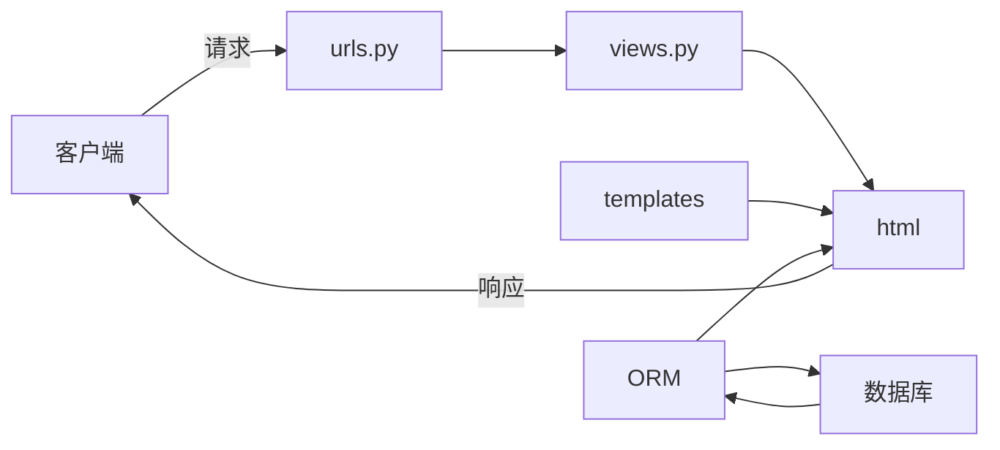

# Django项目创建流程

## 准备

***

### 1. 创建虚拟环境并运行虚拟环境

```shell
py -m venv .venv
Set-ExecutionPolicy -ExecutionPolicy RemoteSigned -Scope Process # win10 Powershell 获取执行策略临时签名
.venv/Scripts/Activate.ps1 # Powershell
.venv/Scripts/activate.bat # cmd
```

### 2. 下载Django并创建Django项目

```shell
py -m pip install django -i https://pypi.tuna.tsinghua.edu.cn/simple/
django-admin startproject Name
```

### 3. 修改时区语言(settings.py)

```python
LANGUAGE_CODE = 'zh-hans'

TIME_ZONE = 'Asia/Shanghai'
```

### 4. 迁移(首次初始化并创建数据库 默认使用sqlite)

`py manage.py migrate`

### 5. 创建一个管理员账号

`py manage.py createsuperuser`

### 6. 可选

#### 6.1. 自定义项目模板(settings.py)

```python
TEMPLATES = [
    {
        'DIRS': [os.path.join(BASE_DIR, 'templates')],
    },
]
```

#### 6.2. 配置数据库(settings.py 默认sqlite)

```python
DATABASES = {
    'default': {
        'ENGINE': 'django.db.backends.mysql',
        'OPTIONS': {
            'read_default_file': '/path/to/my.cnf',
        },
    }
}
```

## 常用

***

### 1. 运行本地服务器测试

`py manage.py runserver`

### 2. 应用相关

#### 2.1. 创建应用

`py manage.py startapp Appname`

#### 2.2. 创建模型(类似数据库表)

`appname/models.py`

#### 2.3. 模型加入后台管理界面

`appname/admin.py`

#### 2.4. 注册应用(settings.py)

`INSTALLED_APPS= ['appname.apps.XXXConfig',]`

#### 2.5. 检测并备份模型修改

`py manage.py makemigrations appname`

#### 2.6. 命令行检视迁移备份

`py manage.py sqlmigrate appname 001`

#### 2.7. 迁移到数据库

`py manage.py migrate`

#### 2.8. 编写视图

`appname/views.py`

#### 2.9. 映射url

`appname/urls.py(需创建)`
`mysite/urls.py(根url include(appname)`

#### 2.10. 创建模板

`appname/templates/appname/xxx.html`

## 拓展

***

### 1. pip一键导出和安装

```shell
pip freeze > requirements.txt
pip install -r requirements.txt
```

### 2. Django命令行增删改查

`py manage.py shell`

### Django请求流程


